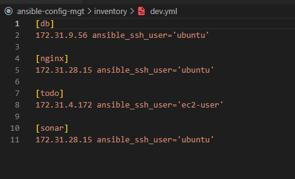

# Project 14
## EXPERIENCE CONTINUOUS INTEGRATION WITH JENKINS | ANSIBLE | ARTIFACTORY | SONARQUBE | PHP

### What is Continuous Integration?
In software engineering, Continuous Integration (CI) is a practice of merging all developers’ working copies to a shared mainline (e.g., Git Repository or some other version control system) several times per day. Frequent merges reduce chances of any conflicts in code and allow to run tests more often to avoid massive rework if something goes wrong. This principle can be formulated as Commit early, push often.

### Continuous Integration in The Real World

### Common Best Practices of CI/CD
==================================

1. Maintain a code repository
2. Automate build process
3. Make builds self-tested
4. Everyone commits to the baseline every day
5. Every commit to baseline should be built
6. Every bug-fix commit should come with a test case
7. Keep the build fast
8. Test in a clone of production environment
9. Make it easy to get the latest deliverables
10. Everyone can see the results of the latest build
11. Automate deployment (if you are confident enough in your CI/CD pipeline and willing to go for a fully automated Continuous Deployment)

### SIMULATING A TYPICAL CI/CD PIPELINE FOR A PHP BASED APPLICATION

### Setup environment 

### Continous integration setup 

### Ansible inventory file 

### CI invemory file

### Dev invenroty file

### ANSIBLE ROLES FOR CI ENVIRONMENT with SonarQube and Artifactory

## Why do we need SonarQube?

- SonarQube is an open-source platform developed by SonarSource for continuous inspection of code quality, it is used to perform automatic reviews with static analysis of code to detect bugs, code smells, and security vulnerabilities. 

## Why do we need Artifactory?

- Artifactory is a product by JFrog that serves as a binary repository manager. The binary repository is a natural extension to the source code repository. In that, the outcome of your build process is stored. It can be used for certain other automation.

### Task 1 Configuring Ansible For Jenkins Deployment and Blue Ocean installation

- Intall ansible and Blue Ocean Plugin
- create a new pipeline 
- select jenkins
- connect Jenkins with GitHub

### Task 2 -- Create Jenkins file 

- create a new dir called `deploy ` and in it create a file called ` jenkinsfile `

- add the codes below to the jenkins file

- go to ansible pipeline in jenkins and configure ansible to use the jenkinsfile

- add, commit and push ypur code to github

- click build to test the configuration 

### Task 3 Create a new git branch and name it feature/jenkinspipeline-statges 

- add another build stage to the existing one in jenkinsfile called test.
- paste the below sippet code 

- add,commit and push the new codes to gitHub
- click on scan repository now to reflect the branch in jenkins

### Practice task to build several stages

1. Create a pull request to merge the latest code into the main branch
2. After merging the PR, go back into your terminal and switch into the main branch.
3. Pull the latest change.
4. Create a new branch, add more stages into the Jenkins file to simulate below phases. (Just add an echo command like we have in build and test stages)
   + Package 
   +  Deploy 
   + Clean up
5. Verify in Blue Ocean that all the stages are working, then merge your feature branch to the main branch
6. Eventually, your main branch should have a successful pipeline 

--- 

#### RUNNING ANSIBLE PLAYBOOK FROM JENKINS

- Creating Jenkinsfile from scratch. 
- delete all the codes in the jenkinsfile
-  Ensure that Ansible runs against the Dev environment successfully.
- Jenkins needs to export the ANSIBLE_CONFIG environment variable. 
- Put the .ansible.cfg file alongside Jenkinsfile in the deploy directory. 
-  Then, using the Pipeline Syntax tool in Ansible, generate the syntax to create environment variables to set

- ansible.cfg must be exported to environment variable so that Ansible knows where to find Roles.

-  Because you will possibly run Jenkins from different git branches, the location of Ansible roles will change. Therefore, you must handle this dynamically

-  use Linux Stream Editor `sed` to update the section roles_path each time there is an execution.

-  Ensure that you start the Jenkinsfile with a clean up step to always delete the previous workspace before running a new one.

-  Ensure in the Jenkinsfile to check out the main git branch or current branch you are runing the playbook.

- always run ` git branch -a ` to confirm  

- to deploy other enviroments we will parameterise the deployment. So that at the point of execution, the appropriate values are applied.

### Parameterizing Jenkinsfile For Ansible Deployment

- To deploy to other environments, we will need to use parameters
- update `sit.yml` in the inventory file

- Update Jenkinsfile to introduce `parameterization`.

### CI/CD PIPELINE FOR TODO APPLICATION

- We already have tooling website as a part of deployment through Ansible. Here we will introduce another ` PHP application ` to add to the list of software products we are managing in our infrastructure. The good thing with this particular application is that it has unit tests, and it is an ideal application to show an `end-to-end CI/CD pipeline for a particular application`.

- Our goal here is to deploy the application onto servers directly from Artifactory rather than from git. If you have not updated Ansible with an Artifactory role, simply use this guide to create an Ansible role for Artifactory (ignore the Nginx part). ` Configure Artifactory on Ubuntu 20.04 `

### Phase 1 – Prepare Jenkins

- Fork the repository below into your GitHub account
https://github.com/darey-devops/php-todo.git and clone into your Jenkins Server

- On you Jenkins server, install PHP, its dependencies and Composer tool (Feel free to do this manually at first, then update your Ansible accordingly later)

    ` sudo apt install -y zip libapache2-mod-php phploc php-{xml,bcmath,bz2,intl,gd,mbstring,mysql,zip} `

### Install Jenkins plugins
- Plot plugin
- Artifactory plugin

### Phase 2 – Integrate Artifactory repository with Jenkins

- Create a dummy Jenkinsfile in the repository
- Using Blue Ocean, create a multibranch Jenkins pipeline
- On the database server, create database and user
` Create database homestead; `
` CREATE USER 'homestead'@'%' IDENTIFIED BY 'sePret^i'; `
` GRANT ALL PRIVILEGES ON * . * TO 'homestead'@'%';

### Update the database connectivity requirements in the file .env.sample

- Update Jenkinsfile with proper pipeline configuration

--- 

pipeline {
    agent any

  stages {

     stage("Initial cleanup") {
          steps {
            dir("${WORKSPACE}") {
              deleteDir()
            }
          }
        }

    stage('Checkout SCM') {
      steps {
            git branch: 'main', url: 'https://github.com/darey-devops/php-todo.git'
      }
    }

    stage('Prepare Dependencies') {
      steps {
             sh 'mv .env.sample .env'
             sh 'composer install'
             sh 'php artisan migrate'
             sh 'php artisan db:seed'
             sh 'php artisan key:generate'
      }
    }
  }
}

---
### Notice the Prepare Dependencies section

- The required file by PHP is .env so we are renaming .env.sample to .env
Composer is used by PHP to install all the dependent libraries used by the application
- php artisan uses the ` .env ` file to setup the required database objects – (After successful run of this step, login to the database, run ` show tables ` and you will see the tables being created for you)

- Update the Jenkinsfile to include Unit tests step

--- 
    stage('Execute Unit Tests') {
      steps {
             sh './vendor/bin/phpunit'
      } 

### Phase 3 – Code Quality Analysis

- This is one of the areas where developers, architects and many stakeholders are mostly interested in as far as product development is concerned. As a DevOps engineer, you also have a role to play. Especially when it comes to setting up the tools.

- For PHP the most commonly tool used for code quality analysis is ` phploc `. Read the article here for more

- The data produced by ` phploc ` can be ploted onto graphs in Jenkins.

- Add the code analysis step in Jenkinsfile. The output of the data will be saved in build/logs/phploc.csv file.

--- 

    stage('Code Analysis') {
      steps {
        sh 'phploc app/ --log-csv build/logs/phploc.csv'

  }
}

### Plot the data using plot Jenkins plugin.

- This plugin provides generic plotting (or graphing) capabilities in Jenkins. It will plot one or more single values variations across builds in one or more plots. Plots for a particular job (or project) are configured in the job configuration screen, where each field has additional help information. Each plot can have one or more lines (called data series). After each build completes the plots’ data series latest values are pulled from the CSV file generated by ` phploc` .

--- 
    stage('Plot Code Coverage Report') {
      steps {

            plot csvFileName: 'plot-396c4a6b-b573-41e5-85d8-73613b2ffffb.csv', csvSeries: [[displayTableFlag: false, exclusionValues: 'Lines of Code (LOC),Comment Lines of Code (CLOC),Non-Comment Lines of Code (NCLOC),Logical Lines of Code (LLOC)                          ', file: 'build/logs/phploc.csv', inclusionFlag: 'INCLUDE_BY_STRING', url: '']], group: 'phploc', numBuilds: '100', style: 'line', title: 'A - Lines of code', yaxis: 'Lines of Code'
            plot csvFileName: 'plot-396c4a6b-b573-41e5-85d8-73613b2ffffb.csv', csvSeries: [[displayTableFlag: false, exclusionValues: 'Directories,Files,Namespaces', file: 'build/logs/phploc.csv', inclusionFlag: 'INCLUDE_BY_STRING', url: '']], group: 'phploc', numBuilds: '100', style: 'line', title: 'B - Structures Containers', yaxis: 'Count'
            plot csvFileName: 'plot-396c4a6b-b573-41e5-85d8-73613b2ffffb.csv', csvSeries: [[displayTableFlag: false, exclusionValues: 'Average Class Length (LLOC),Average Method Length (LLOC),Average Function Length (LLOC)', file: 'build/logs/phploc.csv', inclusionFlag: 'INCLUDE_BY_STRING', url: '']], group: 'phploc', numBuilds: '100', style: 'line', title: 'C - Average Length', yaxis: 'Average Lines of Code'
            plot csvFileName: 'plot-396c4a6b-b573-41e5-85d8-73613b2ffffb.csv', csvSeries: [[displayTableFlag: false, exclusionValues: 'Cyclomatic Complexity / Lines of Code,Cyclomatic Complexity / Number of Methods ', file: 'build/logs/phploc.csv', inclusionFlag: 'INCLUDE_BY_STRING', url: '']], group: 'phploc', numBuilds: '100', style: 'line', title: 'D - Relative Cyclomatic Complexity', yaxis: 'Cyclomatic Complexity by Structure'      
            plot csvFileName: 'plot-396c4a6b-b573-41e5-85d8-73613b2ffffb.csv', csvSeries: [[displayTableFlag: false, exclusionValues: 'Classes,Abstract Classes,Concrete Classes', file: 'build/logs/phploc.csv', inclusionFlag: 'INCLUDE_BY_STRING', url: '']], group: 'phploc', numBuilds: '100', style: 'line', title: 'E - Types of Classes', yaxis: 'Count'
            plot csvFileName: 'plot-396c4a6b-b573-41e5-85d8-73613b2ffffb.csv', csvSeries: [[displayTableFlag: false, exclusionValues: 'Methods,Non-Static Methods,Static Methods,Public Methods,Non-Public Methods', file: 'build/logs/phploc.csv', inclusionFlag: 'INCLUDE_BY_STRING', url: '']], group: 'phploc', numBuilds: '100', style: 'line', title: 'F - Types of Methods', yaxis: 'Count'
            plot csvFileName: 'plot-396c4a6b-b573-41e5-85d8-73613b2ffffb.csv', csvSeries: [[displayTableFlag: false, exclusionValues: 'Constants,Global Constants,Class Constants', file: 'build/logs/phploc.csv', inclusionFlag: 'INCLUDE_BY_STRING', url: '']], group: 'phploc', numBuilds: '100', style: 'line', title: 'G - Types of Constants', yaxis: 'Count'
            plot csvFileName: 'plot-396c4a6b-b573-41e5-85d8-73613b2ffffb.csv', csvSeries: [[displayTableFlag: false, exclusionValues: 'Test Classes,Test Methods', file: 'build/logs/phploc.csv', inclusionFlag: 'INCLUDE_BY_STRING', url: '']], group: 'phploc', numBuilds: '100', style: 'line', title: 'I - Testing', yaxis: 'Count'
            plot csvFileName: 'plot-396c4a6b-b573-41e5-85d8-73613b2ffffb.csv', csvSeries: [[displayTableFlag: false, exclusionValues: 'Logical Lines of Code (LLOC),Classes Length (LLOC),Functions Length (LLOC),LLOC outside functions or classes ', file: 'build/logs/phploc.csv', inclusionFlag: 'INCLUDE_BY_STRING', url: '']], group: 'phploc', numBuilds: '100', style: 'line', title: 'AB - Code Structure by Logical Lines of Code', yaxis: 'Logical Lines of Code'
            plot csvFileName: 'plot-396c4a6b-b573-41e5-85d8-73613b2ffffb.csv', csvSeries: [[displayTableFlag: false, exclusionValues: 'Functions,Named Functions,Anonymous Functions', file: 'build/logs/phploc.csv', inclusionFlag: 'INCLUDE_BY_STRING', url: '']], group: 'phploc', numBuilds: '100', style: 'line', title: 'H - Types of Functions', yaxis: 'Count'
            plot csvFileName: 'plot-396c4a6b-b573-41e5-85d8-73613b2ffffb.csv', csvSeries: [[displayTableFlag: false, exclusionValues: 'Interfaces,Traits,Classes,Methods,Functions,Constants', file: 'build/logs/phploc.csv', inclusionFlag: 'INCLUDE_BY_STRING', url: '']], group: 'phploc', numBuilds: '100', style: 'line', title: 'BB - Structure Objects', yaxis: 'Count'

      }
    }

-  Plot the data using plot Jenkins plugin.

### Bundle the application code for into an artifact (archived package) upload to Artifactory

--- 

  stage ('Package Artifact') {

    steps {
            sh 'zip -qr php-todo.zip ${WORKSPACE}/*'
     }
    }

### Publish the resulted artifact into Artifactory

--- 
     stage ('Upload Artifact to Artifactory') {
          steps {
            script { 
                 def server = Artifactory.server 'artifactory-server'                 
                 def uploadSpec = """{
                    "files": [
                      {
                       "pattern": "php-todo.zip",
                       "target": "<name-of-artifact-repository>/php-todo",
                       "props": "type=zip;status=ready"

                       }
                    ]
                 }""" 

                 server.upload spec: uploadSpec
               }
            }

        }

### Deploy the application to the dev environment by launching Ansible pipeline

--- 
    stage ('Deploy to Dev Environment') {
      steps {
       build job: 'ansible-project/main', parameters: [[$class: 'StringParameterValue', name: 'env', value: 'dev']], propagate: false, wait: true
    }
  }

- The build job used in this step tells Jenkins to start another job. In this case it is the ansible-project job, and we are targeting the main branch. Hence, we have ansible-project/main. Since the Ansible project requires parameters to be passed in, we have included this by specifying the parameters section. The name of the parameter is env and its value is dev. Meaning, deploy to the Development environment.

- But how are we certain that the code being deployed has the quality that meets corporate and customer requirements? Even though we have implemented Unit Tests and Code Coverage Analysis with phpunit and phploc, we still need to implement Quality Gate to ensure that ONLY code with the required code coverage, and other quality standards make it through to the environments.

- To achieve this, we need to configure SonarQube – An open-source platform developed by SonarSource for continuous inspection of code quality to perform automatic reviews with static analysis of code to detect bugs, code smells, and security vulnerabilities.

### SONARQUBE INSTALLATION

- Software Quality – The degree to which a software component, system or process meets specified requirements based on user needs and expectations.
- Software Quality Gates – Quality gates are basically acceptance criteria which are usually presented as a set of predefined quality criteria that.

- In this project we will use predefined Quality Gates (also known as The Sonar Way). Software testers and developers would normally work with project leads and architects to create custom quality gates.

### using Ansible to install and configure SonarQube 

### Access SonarQube  using browser, type server’s IP address followed by port 9000

--- 

- http://3.139.142.188:9000 

### Login to SonarQube with default administrator username and password – ` admin `

### CONFIGURE SONARQUBE AND JENKINS FOR QUALITY GATE

-  In Jenkins, install ` SonarScanner plugin `

- Navigate to configure system in Jenkins. Add SonarQube server as shown below:

- Manage Jenkins > Configure System

### Generate authentication token in SonarQube

 - User > My Account > Security > Generate Tokens

 

### Configure Quality Gate Jenkins Webhook in SonarQube – The URL should point to your Jenkins server http://3.139.142.188:9000/sonar/sonarqube-webhook/

- Administration > Configuration > Webhooks > Create

### Setup SonarQube scanner from Jenkins – Global Tool Configuration

- Manage Jenkins > Global Tool Configuration

### Update Jenkins Pipeline to include SonarQube scanning and Quality Gate

- Below is the snippet for a Quality Gate stage in Jenkinsfile.

--- 
    stage('SonarQube Quality Gate') {
        environment {
            scannerHome = tool 'SonarQubeScanner'
        }
        steps {
            withSonarQubeEnv('sonarqube') {
                sh "${scannerHome}/bin/sonar-scanner"
            }

        }
    }

### NOTE: The above step will fail because we have not updated `sonar-scanner.properties

- Configure sonar-scanner.properties – From the step above, Jenkins will install the scanner tool on the Linux server. You will need to go into the tools directory on the server to configure the properties file in which SonarQube will require to function during pipeline execution.

`  cd /var/lib/jenkins/tools/hudson.plugins.sonar.SonarRunnerInstallation/SonarQubeScanner/conf/ `

- Open sonar-scanner.properties file

` sudo vi sonar-scanner.properties `

- Add configuration related to php-todo project

--- 
sonar.host.url=http://3.139.142.188:9000

sonar.projectKey=php-todo #----- Default source code encoding

sonar.sourceEncoding=UTF-8

sonar.php.exclusions=**/vendor/**

sonar.php.coverage.reportPaths=build/logs/clover.xml

sonar.php.tests.reportPath=build/logs/junit.xml

### HINT: To know what exactly to put inside the sonar-scanner.properties file, SonarQube has a configurations page where you can get some directions.

- A brief explanation of what is going on the the stage – set the environment variable for the scannerHome use the same name used when you configured SonarQube Scanner from Jenkins Global Tool Configuration. If you remember, the name was SonarQubeScanner. Then, within the steps use shell to run the scanner from bin directory.

- To further examine the configuration of the scanner tool on the Jenkins server – navigate into the tools directory

` cd /var/lib/jenkins/tools/hudson.plugins.sonar.SonarRunnerInstallation/SonarQubeScanner/bin `

- List the content to see the scanner tool sonar-scanner. That is what we are calling in the pipeline script.

- Output of ls -latr

--- 

ubuntu@ip-172-31-22-8:/var/lib/jenkins/tools/hudson.plugins.sonar.SonarRunnerInstallation/SonarQubeScanner/bin$ ls -latr
total 24
-rwxr-xr-x 1 jenkins jenkins 2550 Oct  2 12:42 sonar-scanner.bat
-rwxr-xr-x 1 jenkins jenkins  586 Oct  2 12:42 sonar-scanner-debug.bat
-rwxr-xr-x 1 jenkins jenkins  662 Oct  2 12:42 sonar-scanner-debug
-rwxr-xr-x 1 jenkins jenkins 1823 Oct  2 12:42 sonar-scanner
drwxr-xr-x 2 jenkins jenkins 4096 Dec 26 18:42 .

### So far you have been given code snippets on each of the stages within the Jenkinsfile. But, you should also be able to generate Jenkins configuration code yourself.

- To generate Jenkins code, navigate to the dashboard for the php-todo pipeline and click on the Pipeline Syntax menu item

- Dashboard > php-todo > Pipeline Syntax 

![image for generating pipeline]

- Click on Steps and select withSonarQubeEnv – This appears in the list because of the previous SonarQube configurations you have done in Jenkins. Otherwise, it would not be there.

- Within the generated block, you will use the sh command to run shell on the server. For more advanced usage in other projects, you can add to bookmarks this SonarQube documentation page in your browser.

### End-to-End Pipeline Overview

- Indeed, this has been one of the longest projects from Project 1, and if everything has worked out for you so far, you should have a view like below:

![image of blue Ocean end to end pipeline ]

### But we are not completely done yet!

The quality gate we just included has no effect. Why? Well, because if you go to the SonarQube UI, you will realise that we just pushed a poor-quality code onto the development environment.

- Navigate to php-todo project in SonarQube

- There are bugs, and there is 0.0% code coverage. (code coverage is a percentage of unit tests added by developers to test functions and objects in the code)

- If you click on php-todo project for further analysis, you will see that there is 6 hours’ worth of technical debt, code smells and security issues in the code.

- In the development environment, this is acceptable as developers will need to keep iterating over their code towards perfection. But as a DevOps engineer working on the pipeline, we must ensure that the quality gate step causes the pipeline to fail if the conditions for quality are not met.

### Conditionally deploy to higher environments
- In the real world, developers will work on feature branch in a repository (e.g., GitHub or GitLab). There are other branches that will be used differently to control how software releases are done. You will see such branches as:

- Develop
- Master or Main
(The * is a place holder for a version number, Jira Ticket name or some description. It can be something like Release-1.0.0)
- Feature/*
- Release/*
- Hotfix/*
- etc.

- There is a very wide discussion around release strategy, and git branching strategies which in recent years are considered under what is known as ` GitFlow `
- (Have a read and keep as a bookmark – it is a possible candidate for an interview discussion, so take it seriously!)

- Assuming a basic gitflow implementation restricts only the develop branch to deploy code to Integration environment like sit.

### Let us update our Jenkinsfile to implement this:

- First, we will include a When condition to run Quality Gate whenever the running branch is either develop, hotfix, release, main, or master
--- 

when { branch pattern: "^develop*|^hotfix*|^release*|^main*", comparator: "REGEXP"}

--- 

- Then we add a timeout step to wait for SonarQube to complete analysis and 
successfully finish the pipeline only when code quality is acceptable.
--- 
   
    timeout(time: 1, unit: 'MINUTES') {
        waitForQualityGate abortPipeline: true
    }

- The complete stage will now look like this:

--- 
    stage('SonarQube Quality Gate') {
      when { branch pattern: "^develop*|^hotfix*|^release*|^main*", comparator: "REGEXP"}
        environment {
            scannerHome = tool 'SonarQubeScanner'
        }
        steps {
            withSonarQubeEnv('sonarqube') {
                sh "${scannerHome}/bin/sonar-scanner -Dproject.settings=sonar-project.properties"
            }
            timeout(time: 1, unit: 'MINUTES') {
                waitForQualityGate abortPipeline: true
            }
        }
    }

--- 
- To test, create different branches and push to GitHub. You will realise that only branches other than develop, hotfix, release, main, or master will be able to deploy the code.

- If everything goes well, you should be able to see something like this:

![iamge of qulaity gate ]

### In conclusion on Sonar Quality Gates

- Notice that with the current state of the code, it cannot be deployed to Integration environments due to its quality. In the real world, DevOps engineers will push this back to developers to work on the code further, based on SonarQube quality report. Once everything is good with code quality, the pipeline will pass and proceed with sipping the codes further to a higher environment.

### creating jenkins slaves 

- Introduce Jenkins agents/slaves – Add 2 more servers to be used as Jenkins slave.

- Configure Jenkins to run its pipeline jobs randomly on any available slave nodes.
Configure webhook between Jenkins and GitHub to automatically run the pipeline when there is a code push.

